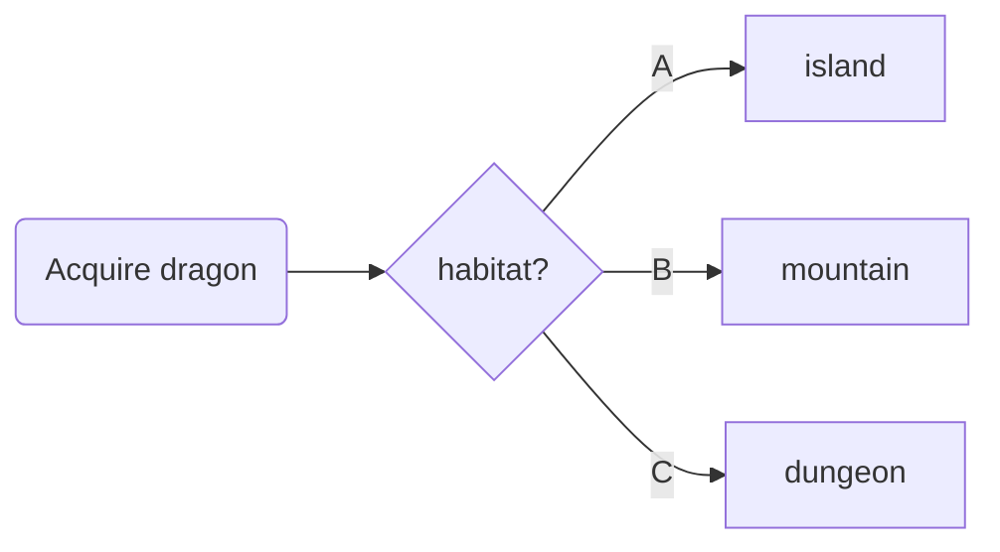

# Server JS Examples

::left::

  <div v-click class="flex flex-col justify-start items-center h-full pb-8">
    <div>Prism syntax highlighter</div>
    <span class="featured pb-8">~7kb</span>
       <div class="bg-black grid place-content-center w-full h-full">

```jsx 

function Equipment() {
  return (
    <div>
      <h1>Equipment</h1>
      <span class="subtitle">
        Everything you need to train your dragon
      </span>
    </div>
}

```

</div>
  </div>

::right::

  <div v-click class="flex flex-col justify-start items-center h-full pb-8">
    <div>Mermaid diagrams</div>
    <span class="featured pb-8">~83 kB</span>
    <div class="bg-black grid place-content-center w-full h-full">



</div>

  </div>
