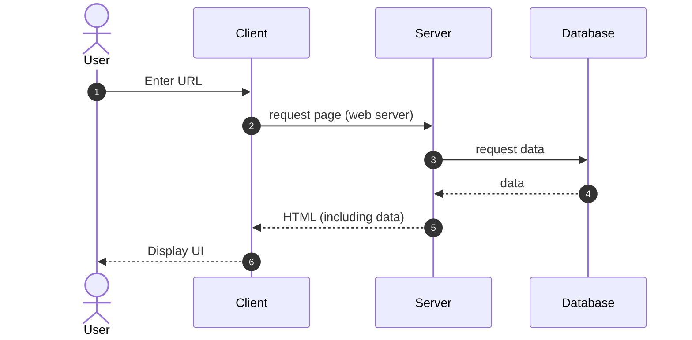

# Client-Server communication (before JavaScript)

```mermaid 
sequenceDiagram
    actor User
    autonumber
    User->>Client: Enter URL
    Client->>Server: request page (web server)
    Server->>Database: request data
    Database-->>Server: data
    Server-->>Client: HTML (including data)
    Client-->>User: Display UI
```