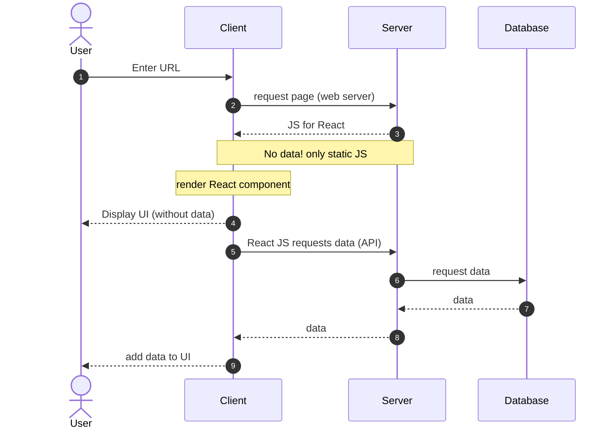

# React: client-side rendering (CSR)

```mermaid 
sequenceDiagram
    actor User
    autonumber
    User->>Client: Enter URL
    Client->>Server: request page (web server)
    Server-->>Client: JS for React
    Note over Client,Server: No data! only static JS
    Note over Client: render React component
    Client-->>User: Display UI (without data)
    Client->>Server: React JS requests data (API)
    Server->>Database: request data
    Database-->>Server: data
    Server-->>Client: data
    Client-->>User: add data to UI
```