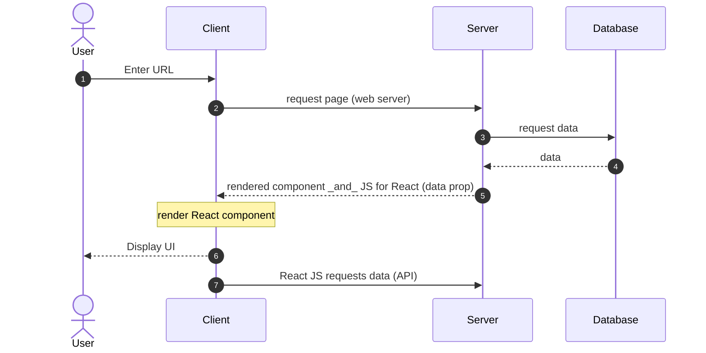

# React: server-side rendering (SSR)

```mermaid 
sequenceDiagram
    actor User
    autonumber
    User->>Client: Enter URL
    Client->>Server: request page (web server)
    Server->>Database: request data
    Database-->>Server: data
    Server-->>Client: rendered component _and_ JS for React (data prop)
    Note over Client: render React component
    Client-->>User: Display UI
    Client->>Server: React JS requests data (API)
```